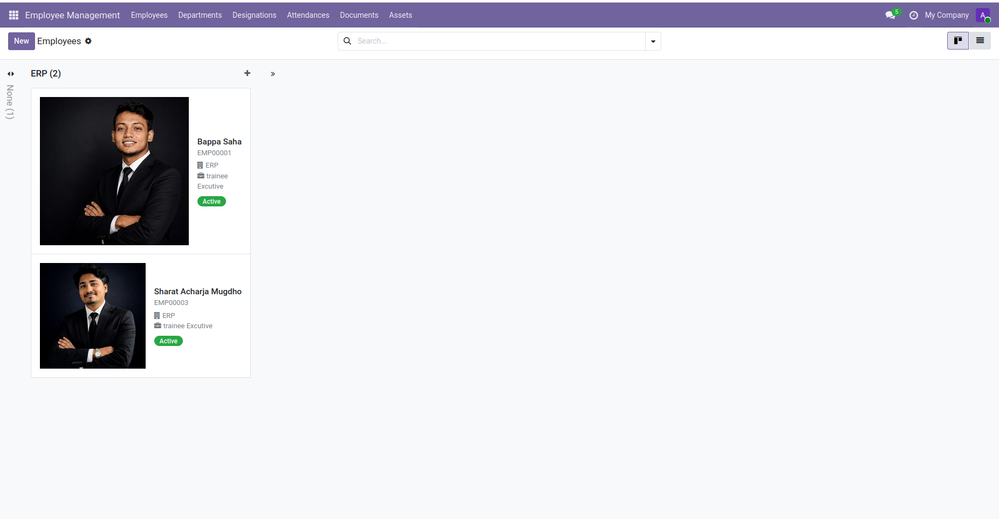
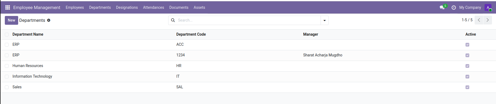
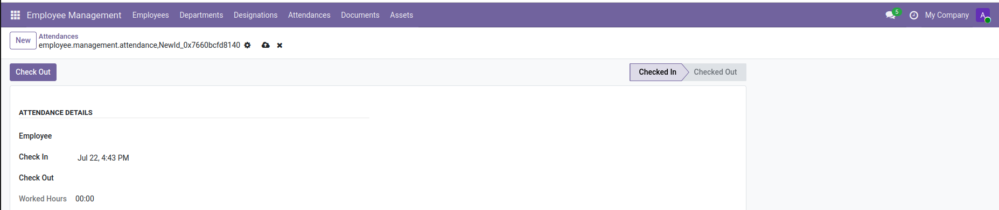
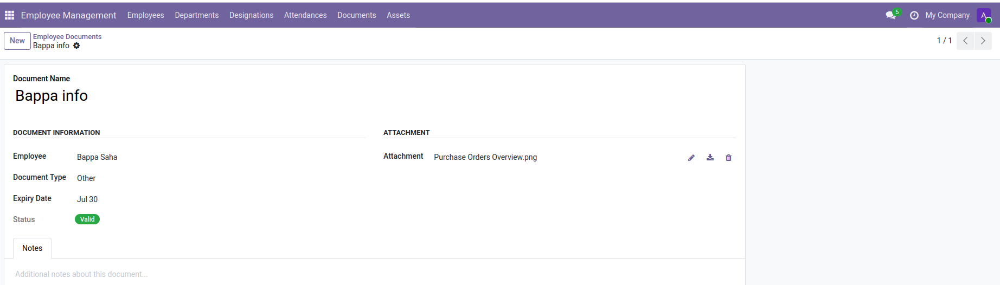

<h1 align="center">Employee Management System</h1>

<p align="center">
    A Custom Employee Management Module Built with Odoo 19 Community Edition
</p>

<p align="center">


</p>

---

## 📖 Overview

**Employee Management System** is a custom Odoo 19 module developed to simplify employee administration inside an organization.

The module centralizes employee information, department management, attendance tracking, document storage, and company asset management into a single ERP solution.

---

## 📸 Screenshots

### 👥 Employee Management

Employee Kanban View displaying employee profiles.

<p align="center">

</p>

---

### 🏢 Department Management

Department list view.

<p align="center">

</p>

---

### 🕒 Attendance Management

Attendance check-in and check-out.

<p align="center">

</p>

---

### 📄 Employee Documents

Document management with attachments.

<p align="center">

</p>

---

## 🏗 Module Architecture

```
employee_management/
│
├── data/
│   ├── department_data.xml
│   └── employee_sequence.xml
│
├── models/
│   ├── employee.py
│   ├── department.py
│   ├── designation.py
│   ├── attendance.py
│   ├── employee_document.py
│   └── employee_asset.py
│
├── security/
│   ├── ir.model.access.csv
│   └── security.xml
│
├── screenshots/
│   ├── employee.png
│   ├── Department.png
│   ├── attendence.png
│   └── info.png
│
├── views/
│   ├── employee_views.xml
│   ├── employee_kanban_views.xml
│   ├── department_views.xml
│   ├── designation_views.xml
│   ├── attendance_views.xml
│   ├── employee_document_views.xml
│   ├── employee_asset_views.xml
│   └── menu_views.xml
│
├── __manifest__.py
├── __init__.py
└── README.md
```

---

## 🚀 Key Features

### 👤 Employee Management

- Employee Profile
- Employee Photo
- Employee Code (Auto Sequence)
- Email & Phone
- Date of Birth
- Joining Date
- Department
- Designation
- Notes
- Active Status

---

### 🏢 Department Management

- Department Creation
- Department Code
- Department Manager
- Active Status

---

### 💼 Designation Management

- Employee Designations
- Position Management

---

### 🕒 Attendance Management

- Employee Check-In
- Employee Check-Out
- Worked Hours
- Attendance History

---

### 📄 Employee Document Management

- Upload Documents
- Document Type
- Expiry Date
- Attachments
- Status
- Notes

---

### 💻 Employee Asset Management

- Company Asset Assignment
- Asset Tracking
- Asset Information

---

### 🔘 Smart Buttons

Employee Form includes:

- Documents
- Assets

Displays related record counts with quick navigation.

---

### 🔄 Employee Workflow

```
Draft
   ↓
Confirmed
   ↓
Active
   ↓
On Leave
   ↓
Resigned
```

---

### 🔐 Security

Role-based access control using:

- Security Groups
- Access Rights
- Record Rules

---

## ⚙ Technologies Used

| Technology | Description |
|------------|-------------|
| Odoo 19 Community | ERP Framework |
| Python | Backend Development |
| PostgreSQL | Database |
| XML | User Interface |
| Odoo ORM | Database Operations |
| Git | Version Control |
| GitHub | Source Code Hosting |
| Ubuntu (WSL) | Development Environment |
| VS Code | IDE |

---

## 🧠 Technical Highlights

This project demonstrates practical experience with:

- Custom Odoo Module Development
- Odoo ORM
- Python Business Logic
- XML Views (Form, Tree, Kanban, Search)
- Smart Buttons
- Computed Fields
- Related Fields
- Many2one Relationships
- One2many Relationships
- Record Rules
- Access Rights
- Security Groups
- Custom Workflow
- Sequences
- Action Windows
- Menus
- PostgreSQL Integration
- Module Installation & Upgrade
- Debugging & Error Resolution

---

## 🚀 Installation

Clone the repository:

```bash
git clone https://github.com/Sharatpsd/odoo-employee-management.git
```

1. Copy the module into your **custom_addons** directory.
2. Update the Apps List.
3. Search for **Employee Management**.
4. Click **Install**.

---

## 📈 Future Enhancements

- Leave Management
- Payroll
- Recruitment
- Employee Contracts
- Performance Evaluation
- Calendar View
- Dashboard, Graph & Pivot Views
- Email Notifications
- QR Attendance
- Barcode Support
- PDF Reports
- Excel Export
- Multi-company Support

---

## 👨‍💻 Author

**Sharat Acharja**
Backend Developer | Odoo Developer | Python Developer

🌐 Portfolio: [sharatpsd.netlify.app](https://sharatpsd.netlify.app/)
💻 GitHub: [github.com/Sharatpsd](https://github.com/Sharatpsd)
💼 LinkedIn: [linkedin.com/in/sharat-acharjya](https://www.linkedin.com/in/sharat-acharjya/)

---

## 🤝 Contributing

Contributions, suggestions, and improvements are welcome.

If you find a bug or have an idea for an enhancement, feel free to open an Issue or submit a Pull Request.

---

## ⭐ Support

If you found this project useful, please consider giving it a ⭐ Star on GitHub.

---

## 📄 License

This project is licensed under the **LGPL-3 License**.
